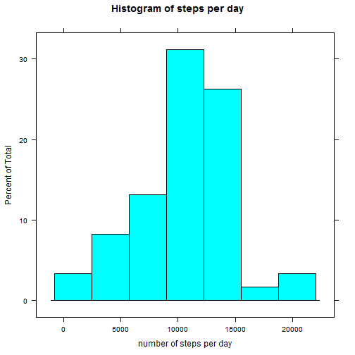

# Reproducible Research: Peer Assessment 1


## Loading and preprocessing the data

Data is a csv file tracking one individual's step activity for 61 days in Oct. and Nov. 2012.  
There are columns for...

* steps (number of steps in 5-minute interval)
* date (YYYY-MM-DD)
* interval (identifier for where in the day the interval falls--each day has intervals 0, 5, 10,...,2350, 2355)


```r
activity <- read.csv("activity.csv", header=TRUE, 
                      colClasses=c("numeric", "Date", "numeric"))
summary(activity)
```

```
##      steps            date               interval   
##  Min.   :  0.0   Min.   :2012-10-01   Min.   :   0  
##  1st Qu.:  0.0   1st Qu.:2012-10-16   1st Qu.: 589  
##  Median :  0.0   Median :2012-10-31   Median :1178  
##  Mean   : 37.4   Mean   :2012-10-31   Mean   :1178  
##  3rd Qu.: 12.0   3rd Qu.:2012-11-15   3rd Qu.:1766  
##  Max.   :806.0   Max.   :2012-11-30   Max.   :2355  
##  NA's   :2304
```

```r
str(activity)
```

```
## 'data.frame':	17568 obs. of  3 variables:
##  $ steps   : num  NA NA NA NA NA NA NA NA NA NA ...
##  $ date    : Date, format: "2012-10-01" "2012-10-01" ...
##  $ interval: num  0 5 10 15 20 25 30 35 40 45 ...
```


## What is mean total number of steps taken per day?

Distribution of total steps per day:


```r
library(lattice)
steps_per_day <- tapply(activity$steps, activity$date, sum)
histogram(steps_per_day, xlab="number of steps per day",
     main="Histogram of steps per day")
```

 

Mean and median steps per day:


```r
mean <- mean(steps_per_day, na.rm=TRUE)
mean
```

```
## [1] 10766
```

```r
median <- median(steps_per_day, na.rm=TRUE)
median
```

```
## [1] 10765
```

In summary, mean is 10766.19 steps per day, and median is 10765 steps per day.


## What is the average daily activity pattern?


```r
#convert interval to a HH:MM time
activity$time <-  format(strptime(formatC(activity$interval,width=4,flag="0"), format="%H%M"),"%H:%M")
steps_per_interval <- tapply(activity$steps, activity$time, mean, na.rm=TRUE)
plot(steps_per_interval, type="l", xlab="time", ylab="steps per interval",
     main="Average steps per 5-minute interval over the day", xaxt="n")
axis(1, at=seq(1,288,10), labels=rownames(steps_per_interval)[seq(1,288,10)])
```

 

```r
#There must be a better way than this to get the x-axis labels to be in time format,
#but I couldn't discover one.
```


## Imputing missing values


```r
num_missing <- nrow(activity[is.na(activity$steps) | is.na(activity$date) | is.na(activity$interval),])
num_missing
```

```
## [1] 2304
```
Total number of rows with missing data is 2304.  

Any interval with missing number of steps will now be filled in with mean number of steps for that 
interval across all days in dataset. A new dataset, *activity_imputed*, is created with this imputation done.


```r
activity_imputed <- activity #copy the original
#replace NAs in the "steps" column
for(i in 1:length(activity_imputed$steps)) {
  if (is.na(activity_imputed$steps[i])) {
    activity_imputed$steps[i] <- 
        mean(activity[is.na(activity$steps)==FALSE & activity$interval == activity$interval[i],]$steps)
  }
}
summary(activity_imputed)
```

```
##      steps            date               interval        time          
##  Min.   :  0.0   Min.   :2012-10-01   Min.   :   0   Length:17568      
##  1st Qu.:  0.0   1st Qu.:2012-10-16   1st Qu.: 589   Class :character  
##  Median :  0.0   Median :2012-10-31   Median :1178   Mode  :character  
##  Mean   : 37.4   Mean   :2012-10-31   Mean   :1178                     
##  3rd Qu.: 27.0   3rd Qu.:2012-11-15   3rd Qu.:1766                     
##  Max.   :806.0   Max.   :2012-11-30   Max.   :2355
```

Histogram, mean and median for dataset with imputed values:


```r
steps_per_day_imputed <- tapply(activity_imputed$steps, activity_imputed$date, sum)
histogram(steps_per_day_imputed, xlab="number of steps per day with imputed values",
     main="Histogram of steps per day (imputed)")
```

 

```r
mean_imputed <- mean(steps_per_day_imputed) #no need for na.rm
mean_imputed
```

```
## [1] 10766
```

```r
median_imputed <- median(steps_per_day_imputed)
median_imputed
```

```
## [1] 10766
```

The mean with imputed values is 10766.2 steps per day, as compared to is 10766.2 in the original data set.    
The median is 10766.19 steps per day, as compared to 10765 in the original.  
The mean has not changed, suggesting that missing values were evenly distributed across time of day. For example, if there were many missing values at a time of day that tends to have a very high number of steps, replacing those missing values with the average for that time of day would increase the overall average steps per day; but, this did not happen. (Or it means that I did something wrong.) 
The median has changed very little, but it is now a non-integer value, because the mean-per-time-segment values that were used to replace the NAs in the original dataset tend to be non-integer.


## Are there differences in activity patterns between weekdays and weekends?

Creating a factor variable coding weekday vs. weekend:

```r
activity$weekday <- factor(weekdays(activity$date))
levels(activity$weekday) <- c("weekday","weekday","weekend","weekend","weekday","weekday","weekday")
summary(activity$weekday)
```

```
## weekday weekend 
##   12960    4608
```

Plot activity over the day separately for weekday and weekend:


```r
activity$mean_steps_per_interval_day_type <- activity$steps
for(i in 1:length(activity$mean_steps_per_interval_day_type)) {
  activity$mean_steps_per_interval_day_type[i] <- 
    mean(activity[activity$interval==activity$interval[i] & 
                    activity$weekday == activity$weekday[i],]$steps, na.rm=TRUE)
}
#There must be a much better way to do this.

xyplot(mean_steps_per_interval_day_type~interval | weekday, data=activity, type="l", layout=c(1,2))
```

 

Weekdays have a spike of activity in the morning (visit to the gym?), while weekends become active a bit later (sleeping in?) and stay fairly high throughout the day.
